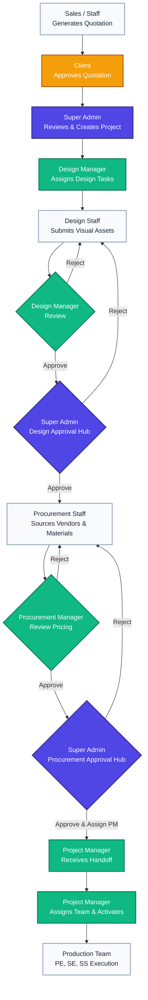

# Interior Design ERP System

This is a comprehensive ERP system tailored for an Interior Design & Manufacturing firm. It streamlines the entire process from initial quotation and client approval through design, procurement, and final production.

## System Architecture

The application is built using a modern MERN stack:
- **Frontend:** React (Vite), React Router, Context API, CSS
- **Backend:** Node.js, Express.js
- **Database:** MongoDB (Mongoose ODM)
- **Authentication:** JWT-based role-based access control (RBAC)

## Multi-Level Workflow & Pipeline

The system is designed around a strict sequential pipeline that guarantees accountability and structured handoffs between departments.

### Workflow Flowchart



### 1. Quotation & Initiation Phase
- **Sales / Staff:** Generates a quotation for a prospective client.
- **Client Approval:** Once the client approves the quotation, the project officially begins.
- **Admin:** The Super Admin reviews the approved quotation and triggers the creation of the Project.

### 2. Design Pipeline
- **Design Manager:** Assigns the design tasks to specific Designers (Design Staff) based on the project requirements.
- **Design Staff:** Works on the design, uploads visual assets, and submits them to the Design Manager for review.
- **Design Manager:** Reviews the submissions. If approved, the Manager forwards the design to the Super Admin.
- **Super Admin (Approval Hub):** Reviews the high-fidelity designs in the `Design Pipeline` tab of the Approval Hub. Clicking **Approve** officially signs off on the design and pushes it to Procurement.

### 3. Procurement Pipeline
*When a design is approved by Admin, a Material Request is automatically generated and routed to the Procurement department.*

- **Procurement Staff:** Receives the assigned `Material Request`. They are responsible for gathering vendor pricing, selecting vendors, and adding the required materials to the "Sourcing Bucket". Once complete, they click **Submit to Manager for Review**.
- **Procurement Manager:** Receives the request in their "Needs Your Review" queue. They verify the vendor selection and budget. Once satisfied, they click **Approve & Send to Admin**.
- **Super Admin (Approval Hub):** The finalized procurement list appears in the `Procurement Pipeline` tab. The Admin reviews the final costs and selects a **Project Manager** to handle the production phase. Clicking **Approve Procurement** triggers the handoff.

### 4. Production Pipeline
- **Project Manager:** Receives the approved project in their "Project Handoff" queue. They are responsible for assigning the core production team:
    - **Project Engineer (PE)**
    - **Site Engineer (SE)**
    - **Site Supervisor (SS)**
- **Team Assignment:** Once the PM assigns the team and accepts the handoff, the project moves from "Planning" to "Active".
- **Execution:** The assigned Project Engineer, Site Engineer, and Supervisor receive notifications and start managing site tasks and daily progress.

## User Roles & Access

- **Super Admin**: Global oversight, final approval authority for Design and Procurement pipelines.
- **Design Manager**: Manages designers, reviews creative assets.
- **Design Staff**: Executes design tasks.
- **Procurement Manager**: Manages vendor relationships, reviews sourcing, and handles production handoffs.
- **Procurement Staff**: Sources materials and vendor quotes.
- **Project Manager**: Oversees the entire production phase, assigns site teams, and manages project activation.
- **Project Engineer / Site Engineer / Supervisor**: Execute and monitor site progress.

## Local Development Setup

1. **Backend:**
   ```bash
   cd Backend
   npm install
   npm run dev
   ```

2. **Frontend:**
   ```bash
   cd Frontend
   npm install
   npm run dev
   ```
